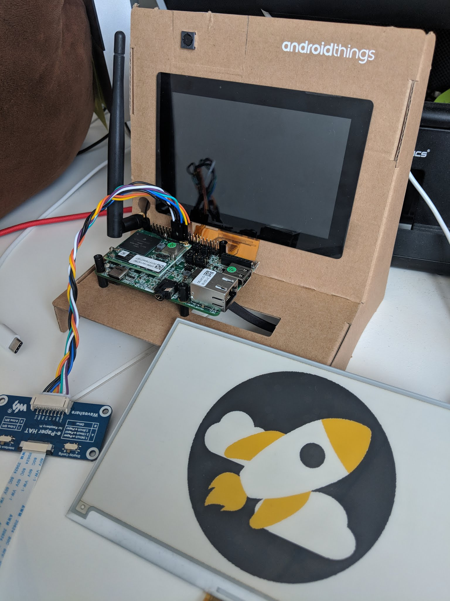

[  ](https://bintray.com/smartnsoft/maven/epaper-hat-driver/_latestVersion)
[](https://opensource.org/licenses/MIT)
[/statusIcon)](https://ci.smartnsoft.com/viewType.html?buildTypeId=AndroidThingsEPaperHatDriver)

# Waveshare e-Paper HAT Display module driver for Android Things

*A very simple Waveshare e-Ink display module driver implementation for Android Things*  

  

## Download

```groovy
dependencies {
    implementation 'com.smartnsoft.androidthings:epaper-hat-driver:0.1.0'
}
```

## Usage

```java
// Access the EPD7X5C display
EPaperDisplay display;
EPaperDisplay.DeviceType epd7x5c = EPaperDisplay.DeviceType.Preset.EPD7X5C.deviceType;
display = EPaperDisplayFactory.create(SPI_NAME, BUSY_GPIO, RESET_GPIO, DC_GPIO, epd7x5c, Orientation.PORTRAIT);

// Clear screen
display.clear();

// Set a bitmap
Bitmap bmp = BitmapFactory.decodeResource(getResources(), R.drawable.rocket);
display.setPixels(bitmap);

// Refresh the screen
display.refresh();

// Close the display when finished
display.close();
```

### Hardware compatible
|                        Device                         | Color  type | Tested |
|:-----------------------------------------------------:|:-----------:|:------:|
| [Waveshare 7.5inch e-Paper Module (A)][EPD7X5A_wiki]  |     B&W     |   Yes  |
| [Waveshare 7.5inch e-Paper Module (B)][EPD7X5B_wiki]  |  B&W  +Red  |   Yes  |
| [Waveshare 7.5inch e-Paper Module (C)][EPD7X5C_wiki]  | B&W +Yellow |   Yes  |
| [Waveshare 5.83inch e-Paper Module (A)][EPD5X8A_wiki] |     B&W     |   Yes  |
| [Waveshare 5.83inch e-Paper Module (B)][EPD5X8B_wiki] |  B&W  +Red  |   No   |
| [Waveshare 5.83inch e-Paper Module (C)][EPD5X8C_wiki] | B&W +Yellow |   No   |

### Hardware connection

| e-Paper | Raspberry Pi 3 |    Pico i.MX7D    |
| ------- | -------------- | ----------------- |
| 3.3V    | 3.3V           | 3.3V              |
| GND     | GND            | GND               |
| DIN     | MOSI (#19)     | MOSI (#19)        |
| CLK     | SCLK (#23)     | SCLK (#23)        |
| CS      | CE0 (#24)      | SPI3 (SS1) (#24)  |
| DC      | BCM25 (#22)    | GPIO5_IO00 (#22)  |
| RST     | BCM17 (#11)    | GPIO1_IO10 (#15)  |
| BUSY    | BCM24 (#18)    | GPIO6_IO12 (#18)  |

## Kudos to

* Novoda, and Blundell for their [InkypHat driver][inkyphat]
* Nilhcem for his [WSEPD driver][wsepd]

## License

This SDK is under the MIT license.

## Author

This Android Things driver for the Waveshare ePaper HAT was proudly made at [Smart&Soft](https://smartnsoft.com/), Paris FRANCE


[EPD7X5A_wiki]: https://www.waveshare.com/wiki/7.5inch_e-Paper_HAT
[EPD7X5B_wiki]: https://www.waveshare.com/wiki/7.5inch_e-Paper_HAT_(B)
[EPD7X5C_wiki]: https://www.waveshare.com/wiki/7.5inch_e-Paper_HAT_(C)
[EPD5X8A_wiki]: https://www.waveshare.com/wiki/5.83inch_e-Paper_HAT
[EPD5X8B_wiki]: https://www.waveshare.com/wiki/5.83inch_e-Paper_HAT_(B)
[EPD5X8C_wiki]: https://www.waveshare.com/wiki/5.83inch_e-Paper_HAT_(C)
[inkyphat]: https://www.novoda.com/blog/porting-a-python-library-to-android-things-the-inkyphat/
[wsepd]: https://github.com/Nilhcem/wsepd-androidthings
